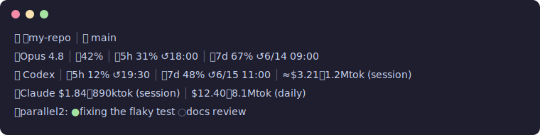

# codex-claude-statusline

[](https://github.com/T-crypto8/codex-claude-statusline/actions/workflows/ci.yml)

[Claude Code](https://claude.com/claude-code) と [Codex CLI](https://github.com/openai/codex) のターミナル下部を「計器盤」にする多段ステータスラインです。



```
🐶 📁my-repo │ 🌿 main
🤖Opus 4.8 │ 📈42% │ 🕐5h 31% ↺18:00 │ 📅7d 67% ↺6/14 09:00
🐾 Codex │ 🕐5h 12% ↺19:30 │ 📅7d 48% ↺6/15 11:00 │ ≈$3.21・1.2Mtok (session)
💰Claude $1.84・890ktok (session) │ $12.40・8.1Mtok (daily)
🤝parallel2: ●fixing the flaky test ○docs review
```

| 行 | 表示内容 | ソース |
|---|---|---|
| 1 | 作業ディレクトリ + git ブランチ | statusLine payload + `git` |
| 2 | モデル / コンテキスト% / 5h・7d レート制限とリセット時刻 | statusLine payload |
| 3 | **Codex CLI** の残り枠 + セッション概算コスト | `~/.codex/sessions` |
| 4 | Claude のセッションコスト + **全セッション日次合計** | payload + ローカル transcript |
| 5 | 並走中の他の Claude Code セッションと直近の指示 | `~/.claude/sessions` |

コストは API 定価ベースの推定値です。サブスクプランでは請求額ではなく「相対的な消費量の目安」として使ってください。未知のモデルはあえて最高単価で計上します(過小評価で安心してしまうより、過大側に倒す設計)。

## 想定ユーザー

**Codex CLI と Claude Code を並用する**メンテナー / AIコーディングのパワーユーザー向け。コスト・コンテキスト消費・残り枠・並走エージェントの状態は、レビューや triage・リリース作業の組み立てに直結します。それを1画面・ローカル完結・依存ゼロで見えるようにします。

## インストール

Python 3.10+ のみ。外部パッケージ不要。

```bash
git clone https://github.com/T-crypto8/codex-claude-statusline.git ~/.claude-statusline
```

`~/.claude/settings.json` に追加:

```json
{
  "statusLine": {
    "type": "command",
    "command": "python3 ~/.claude-statusline/statusline.py"
  }
}
```

## カスタマイズ

```bash
mkdir -p ~/.config/claude-statusline
cp ~/.claude-statusline/config.example.json ~/.config/claude-statusline/config.json
```

- **マスコット変更**: `icons.prefix` を好きな文字に(`"🐱"` `"🦊"` `"❯"` など)。他のアイコンも全部変更可
- **不要な行を消す**: `lines.codex / cost / parallel` を `false` に
- **通貨**: `"USD"` ならそのまま表示。`{"code": "JPY", "symbol": "¥", "fallback_rate": 155}` で円換算([frankfurter.app](https://frankfurter.app) の無料APIを12hキャッシュ、オフライン時は fallback)
- **スクショ安全化**: 表示させたくない文字列(本名・社名・案件名)を `mask_patterns` に入れると出力直前に置換されます。5行目は並走セッションのプロンプトを表示するので特に有効
- 設定パス上書き: `CLAUDE_STATUSLINE_CONFIG=/path/to/config.json`
- 価格表上書き: スクリプト隣に `pricing.json` を置くか `CLAUDE_STATUSLINE_PRICING`

## Codex CLI と使う(Claude Code 不要)

3行目は最初から `~/.codex/sessions` を読んで Codex の残り枠とセッションコストを表示します。Codex メインの人は単体起動でそのまま計器盤になります:

```bash
python3 ~/.claude-statusline/statusline.py        # 1回表示
watch -n 30 python3 ~/.claude-statusline/statusline.py   # tmux ペイン等で常時表示
```

Codex オンリーなら `lines.cost` を `false` に(Claude transcript スキャンなので)、`codex` と `parallel` を残すのがおすすめ。

## 単体の使用量レポート

```bash
python3 usage_estimate.py --today          # 今日
python3 usage_estimate.py --days 7         # 直近7日 (日付/プロジェクト/モデル別)
python3 usage_estimate.py --days 30 --json # JSON出力
```

## 設計メモ

- 重い処理は temp dir 配下にキャッシュ(日次コスト60s / Codexスキャン120s / 為替12h)。表示は常に高速
- 全部 fail-soft: ネット不通・Codex 無し・registry 無し → 「—」表示。クラッシュで行を落とさない

## License

MIT
